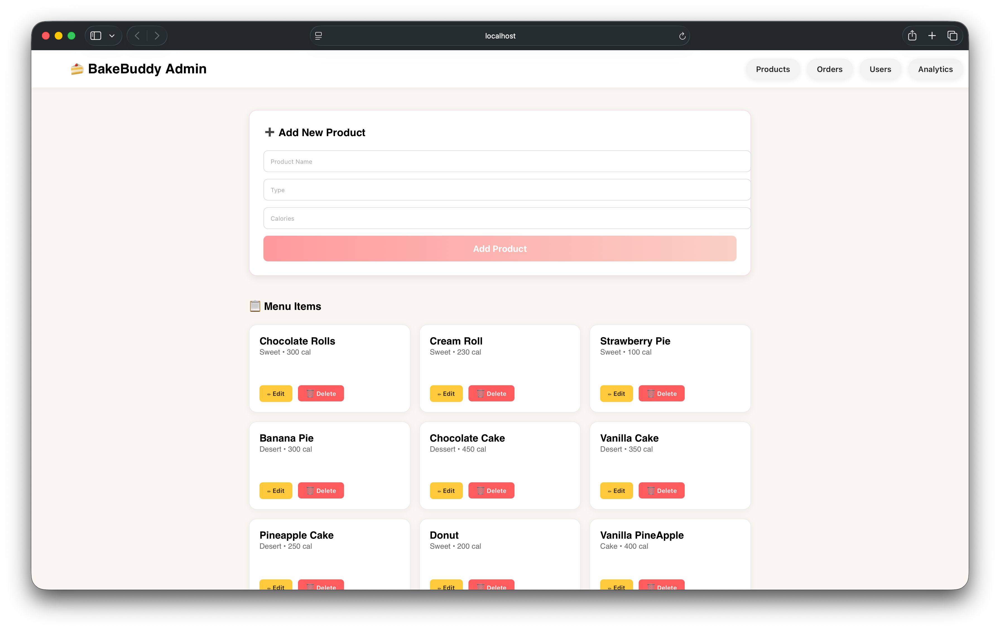

# 🍰 MyDeserts API (Full Stack Project)

A full-stack Node.js project that includes both **client** and **server** sides for managing desserts 🍩.  
Built with **Express**, **MongoDB**, and structured for scalability — this project demonstrates clean architecture, environment configuration, and CRUD operations.

---

## 🧱 Folder Structure

```
Node - JS Project/
│
├── client/              # Frontend (React or other UI)
│
└── server/              # Backend (Express + MongoDB)
    ├── models/          # Mongoose schemas
    ├── index.js         # Main Express app entry
    ├── .env             # Environment variables (not committed)
    ├── package.json     # Backend dependencies
    └── node_modules/
```

---

## 🚀 Features

- Modular architecture with separate **client** and **server**
- RESTful API built with Express
- MongoDB + Mongoose integration
- `.env` configuration for flexible environments
- CORS-friendly structure for full-stack development
- Organized folder separation for scalability

---

## ⚙️ Setup & Installation

### 1️⃣ Clone the Repository

```bash
git clone https://github.com/YashDev-Design/MyDeserts-API.git
cd "Node - JS Project"
```

---

### 2️⃣ Setup the Server

```bash
cd server
npm install
```

Create a `.env` file inside `/server`:

```bash
PORT=10000
MONGO_URI=your_mongodb_connection_string
```

Then run:

```bash
npm run dev
```

You should see:

```
✅ Server running on http://localhost:10000
✅ MongoDB connected successfully
```

---

### 3️⃣ Setup the Client

```bash
cd ../client
npm install
npm start
```

The client will start on its own port (e.g. http://localhost:3000).

---

## 🧠 API Endpoints

| Method | Endpoint           | Description          |
| ------ | ------------------ | -------------------- |
| GET    | `/`                | Server status check  |
| GET    | `/api/deserts`     | Fetch all desserts   |
| POST   | `/api/deserts`     | Add a new dessert    |
| DELETE | `/api/deserts/:id` | Delete dessert by ID |

Example POST body:

```json
{
  "name": "Donut",
  "type": "Sweet",
  "calories": 200
}
```

---

## 🧩 Technologies Used

### 🖥 Backend:

- **Node.js**
- **Express.js**
- **MongoDB + Mongoose**
- **dotenv**
- **Nodemon**

### 🎨 Frontend:

- **React.js** _(or any other framework you use in client folder)_

---

## 🧑‍💻 Author

**Yash Dev (YashDev-Design)**  
🎓 Auburn University at Montgomery  
💼 Student Affairs · Social Media & Marketing Assistant

---

## ⭐ Show Your Support

If you like this project, please ⭐ the repo and share it — every star helps motivate more great work ✨

# 🍰 BakeBuddy — Full Stack Bakery Management App

_A portfolio-grade MERN stack project_

BakeBuddy is a **full-stack bakery management system** featuring an **Admin Dashboard**, REST API, MongoDB database, and a modern responsive UI.  
Admins can **add, edit, delete & manage menu items** (CRUD).  
Designed with real-world scalability, clean architecture & professional UI styling.

---

## 🏗️ Project Architecture (MVC + Full Stack)

```
Node - JS Project/
│
├── client/                        # React Frontend (Admin UI)
│   ├── src/
│   │   ├── App.js                 # Admin Dashboard UI
│   │   ├── api.js                 # Axios API config
│   │   └── index.js
│   └── package.json
│
└── server/                        # Express Backend (MVC)
    ├── src/
    │   ├── server.js              # Main server entry
    │   ├── db.js                  # MongoDB connection
    │   ├── models/
    │   │   └── product.model.js   # Mongoose Schema
    │   ├── routes/
    │   │   └── product.routes.js  # API Routes
    │   └── controllers/
    │       └── product.controller.js
    ├── migrateDesertsToProducts.js
    ├── package.json
    └── .env
```

---

## ✨ Current Features (Phase 1 Complete)

✔ Full CRUD (Create, Read, Update, Delete)  
✔ Modern React Admin Interface  
✔ Express REST API  
✔ MongoDB + Mongoose model  
✔ Fully converted MVC structure  
✔ CORS-enabled  
✔ `.env` support  
✔ Live menu updates without refresh  
✔ Grid-based menu layout  
✔ No Postman needed — UI is fully functional

---

## 🎨 Admin UI Design

Inspired by **Panera Bread / Starbucks / Fazoli’s** dashboard style:

- Poppins / Sora Premium Fonts
- Sticky Full-Width Navbar
- Responsive Grid Layout
- Gradient CTA Buttons
- Hover Animations
- Light Pastel Bakery Theme
- Menu Items instead of "Desserts" list
- Zero horizontal scrolling (mobile friendly)

---

## 🖥️ Admin Dashboard UI Preview

Below is the current **BakeBuddy Admin Dashboard**, featuring:

- Responsive grid-based menu management
- Full-width sticky navbar
- Modern typography & bakery-themed colors
- Edit & Delete controls on every item
- Clean, professional SaaS-style layout

### 📸 Admin UI Preview



---

## 🧠 API Endpoints (Updated)

| Method | Endpoint            | Description        |
| ------ | ------------------- | ------------------ |
| GET    | `/api/products`     | Fetch all products |
| POST   | `/api/products`     | Add new product    |
| PUT    | `/api/products/:id` | Update product     |
| DELETE | `/api/products/:id` | Delete product     |

📌 Example POST body:

```json
{
  "name": "Chocolate Roll",
  "type": "Pastry",
  "calories": 260
}
```

---

## 🚀 Run the Project

### 1️⃣ Clone

```bash
git clone https://github.com/YashDev-Design/MyDeserts-API.git
cd "Node - JS Project"
```

---

### 2️⃣ Setup Backend

```bash
cd server
npm install
```

Create `.env`:

```
PORT=10000
MONGO_URI=your_connection_string
```

Run server:

```bash
npm run dev
```

---

### 3️⃣ Setup Frontend

```bash
cd ../client
npm install
npm start
```

---

## 🔭 Roadmap (Next Steps)

- 🔐 Admin Login (JWT Auth)
- 👥 User Login + Orders
- 🛒 Shopping Cart
- 🧾 Order History
- 🧁 Product Images
- 📱 Customer-Facing Menu UI
- 📊 Analytics Dashboard
- 🌓 Dark Mode Toggle
- 🚀 Deploy to Render / Netlify

---

## 🛠 Tech Stack

**Frontend:** React, Axios, JSX, CSS  
**Backend:** Node.js, Express.js, MVC Pattern  
**Database:** MongoDB + Mongoose  
**Dev Tools:** Nodemon, dotenv, CORS  
**Architecture:** Full Stack, REST API, MVC

---

## 👨‍💻 Developer

**Javeed Quadri Mohammad (YashDev-Design)**  
📍 Auburn University at Montgomery  
🎓 MS Computer Science  
💼 Student Affairs · Social Media & Marketing Assistant

---

## ⭐ Support

If you like this project — star it on GitHub!  
It helps me grow and keeps the bakery open 🍩✨
